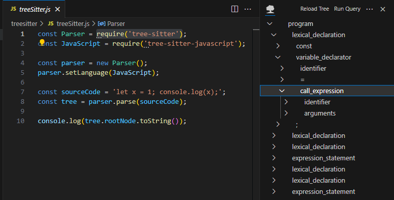
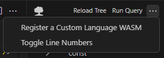
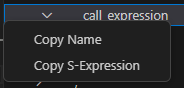

# ASTronomer  🔭 ✨

## 👋 Hey there! 

This repo contains the source code for ASTronomer, a tool which displays TreeSitter Abstract Syntax Trees (ASTs) alongside some tools to make using them easier!

This was created out of my frustration with TreeSitter's (harder than it should be) learning curve. Hope it helps! If you would like to contribute please see the "Contributing" section below!

# How it works

This extension uses the TreeSitter Javascript WebAssembly (WASM) build, this reason boils down to the extension runtime basically being Electron. 

## Parsing 
Sparing much of the nitty gritty details about how TreeSitter Parsing works ([more here](https://tree-sitter.github.io/tree-sitter/using-parsers)), each supported Language requires a Language WASM build. The currently supported are below in the "Supported Languages" subsection. Each of these Languages will be used to parse a document into an AST. The code for this is largely located in `astGenerator.ts`.

## Rendering 

To render the syntax tree we're using VS Code's built in tree view, although in the future a webview will provide more flexibility. The code for this located in `astProvider.ts`. 

## Supported Languages

Currently there are 16 supported languages: 
1. bash
2. c_sharp
3. c
4. cpp
5. go
6. html
7. java
8. javascript
9. php
10. python
11. ql
12. ruby
13. rust
14. toml
15. typescript
16. yaml

### Adding New Languages

There are two easy ways to do this! 

1. Open a PR to add them to this repo so everyone else can benefit from it! 

or 

2. In the extenson dropdown, select "Register a Custom Language WASM" - this will prompt for a language name, this is what VS Code registers the file's language as, and then a path to the WASM on your machine. Currently this will not persist between reloads. 

## Copying sections of the AST

Just right click a node and select "Copy S-Expression" - the S-Expression is how TreeSitter expresses ASTs in text. These also have the nice advantage of being queryable!

## Querying the AST

Select the "Run Query" button at the top of the extension. You wil be prompted for a valid S-Expression. The following is an example of a javascript import statement: `(lexical_declaration (variable_declarator name: (identifier) value: (call_expression function: (identifier) arguments: (arguments (string)))))`

Note: The syntax is a bit finicky and there are many operators described in the TreeSitter [docs here](https://tree-sitter.github.io/tree-sitter/using-parsers#pattern-matching-with-queries). 

There is no need to specify an `@` field, it is automatically added. 

This part of the extension is most susceptible  to bugs, if you find any please open an issue! 

# Contributing

Feel free to contribute your ideas! This was built in one person's vision, the more ideas the better! 